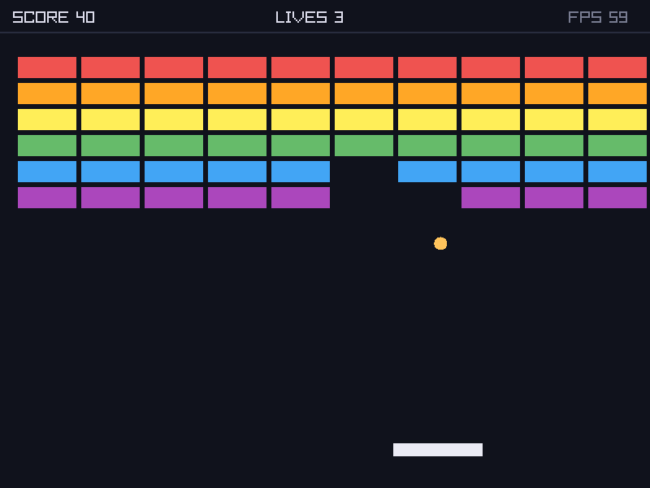
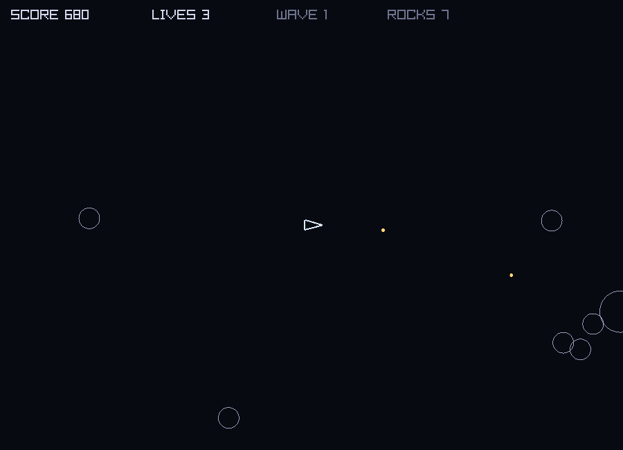

# Cypescript

[](https://github.com/kr4ckhe4d/Cypescript/actions/workflows/ci.yml)
[](https://github.com/kr4ckhe4d/Cypescript/releases)
[](LICENSE)

**Write TypeScript. Get a native binary. Run at Rust speed.**

Cypescript is a compiled, statically-typed language with TypeScript's syntax and none of its
runtime. No VM, no garbage collector, no `node_modules` — `cscript game.csc` produces a
single native executable that starts in microseconds.

```ts
class Vec {
    x: f64 = 0.0;
    y: f64 = 0.0;

    add(other: Vec): void {
        this.x += other.x;
        this.y += other.y;
    }
}

const points: Vec[] = [];
points.push(new Vec());

for (const p of points) {
    p.add(new Vec());
    println(`(${p.x}, ${p.y})`);
}
```

```bash
$ cscript -r hello.csc
(0, 0)
```

---

## It writes arcade games

Two complete games ship in [`example/game/`](example/game/), written entirely in Cypescript
and rendering through the language's own foreign function interface. **The compiler has no
built-in knowledge of graphics** — every call below is a `declare function` binding in
[lib/game.csc](lib/game.csc).

| Breakout | Asteroids |
|---|---|
|  |  |
| Ball physics, brick grid, scoring, lives, synthesised sound | Pooled entities, rocks that split, waves, thrust and rotation |

*Both screenshots are real frames, captured by the games themselves.*

```ts
import { } from "game";

openWindow(800, 600, "my game");
setTargetFps(60);
enableFrameStrings();

let x: f64 = 100.0;

while (!windowShouldClose()) {
    let dt: f64 = deltaTime();
    if (isKeyDown(KEY_LEFT))  { x -= 300.0 * dt; }
    if (isKeyDown(KEY_RIGHT)) { x += 300.0 * dt; }

    beginFrame();
    clearScreen(rgb(16, 18, 28));
    drawRect(x, 400.0, 90.0, 16.0, rgb(235, 235, 245));
    drawText(`x = ${x}`, 16.0, 12.0, 20, rgb(200, 205, 230));
    endFrame();
}

closeWindow();
```

```bash
cscript --bundle mygame.csc      # → mygame.app you can double-click
```

Games hold **flat memory** — steady RSS from 2,000 to 300,000 frames, which is 83 minutes
of play at 60 fps with no growth.

---

## It calls C directly

`declare function` binds any C symbol. No wrapper generation, no build plugin, no compiler
changes — this is the same mechanism the entire game runtime is built on.

```ts
declare function atan2(y: f64, x: f64): f64;
declare function malloc(size: i64): ptr;
declare function free(block: ptr): void;

println(atan2(1.0, 1.0));        // 0.785398

let block: ptr = malloc(64);
free(block);
```

### Your own C, with no build step

Point at a C or C++ file and `cscript` compiles it with your program. No library
to build first, no headers to write, no makefile, no wrapper script:

<!-- snippet: illustrative — runnable version in example/21_c_interop.csc -->
```ts
link source "native/stats.c";        // path is relative to this .csc file
link include "vendor/include";       // where that C finds <tinyclamp/tinyclamp.h>

declare function stats_sum(values: ptr, count: i32): i32;
declare function acc_new(): ptr;     // opaque handles need no type on our side
```

```bash
cscript -r myprogram.csc             # that's the whole workflow
```

Each source is compiled with the driver its language needs — a `.c` file gets C
rules, a `.cpp` file gets C++17 — so ordinary C like `char *p = malloc(n);` just
works. `.m` and `.mm` are handled too, and a `.c` and a `.cpp` can go into the same
program.

See [example/21_c_interop.csc](example/21_c_interop.csc) for C, and
[example/23_cpp_interop.csc](example/23_cpp_interop.csc) for C++ — the latter uses
`std::map` and RAII behind an `extern "C"` boundary, which is where reaching for C++
over C actually pays.

Bind a C-style API under a name that reads well, and ask for a system library:

<!-- snippet: illustrative — runnable version in lib/game.csc -->
```ts
link "raylib";
declare function drawCircle(x: f64, y: f64, r: f64, color: i32): void = "cyps_circle";
```

Link directives can be platform-qualified, so one file describes every OS:

<!-- snippet: illustrative — runnable version in lib/game.csc -->
```ts
link macos framework "Cocoa";
link linux "GL";
link windows "opengl32";
```

---

## It's fast

Best-of-3 on an M-series Mac. Same algorithms, same output, all compiled or run at `-O2`.

| Benchmark | Cypescript | Rust | Node (TS) | Python |
|---|---|---|---|---|
| Primes < 1M (trial division) | **0.051s** | 0.051s | 0.150s | 1.78s |
| `fib(35)` recursive | **0.025s** | 0.025s | 0.126s | 0.634s |

Objects are LLVM structs, so property access is a single instruction rather than a hash
lookup. Reproduce with `bash benchmarks/cross/run_cross_benchmarks.sh 3`.

---

## Install

### macOS (Homebrew)

```bash
brew tap kr4ckhe4d/cypescript
brew install cypescript

# Then compile and run any .csc file:
echo 'println("hello, cypescript!");' > hello.csc
cscript -r hello.csc
```

Requires `clang++` (Xcode Command Line Tools) at compile time.

### Debian / Ubuntu

```bash
sudo apt-get install -y cmake llvm-dev clang
git clone https://github.com/kr4ckhe4d/Cypescript.git && cd Cypescript
bash packaging/build-deb.sh
sudo apt install ./cypescript_*_*.deb
```

(Or download the prebuilt `.deb` artifact from the latest
[CI run](https://github.com/kr4ckhe4d/Cypescript/actions).)

### Arch Linux

```bash
git clone https://github.com/kr4ckhe4d/Cypescript.git
cd Cypescript/packaging/arch
makepkg -si     # builds from the release tarball and runs the test suite
```

Linux support is CI-validated; macOS is the primary development platform.
To build from source on any platform, see [Quick Start](#quick-start).
Maintainers: the full release process is documented in [RELEASING.md](RELEASING.md).

## Documentation

A searchable reference site covering every language feature:

```bash
./launch-docs.sh
```

It also has a playground with a Run button. **That playground is a simplified
interpreter written in JavaScript** ([docs/cypescript-interpreter.js](docs/cypescript-interpreter.js)),
not the compiler — it covers the basics for a quick try in the browser and can
diverge from real behaviour. For anything you intend to rely on, run `cscript`.

## A tour in code

**Classes, interfaces and structural typing** — objects are LLVM structs, not hash maps:

```ts
interface Shape {
    area(): f64;
}

class Circle {
    radius: f64 = 1.0;

    constructor(radius: f64) {
        this.radius = radius;
    }

    area(): f64 {
        return Math.PI * this.radius * this.radius;
    }
}

const c: Circle = new Circle(2.0);
println(c.area());                 // 12.5664
```

**Arrow functions, closures and callback array methods:**

```ts
const numbers: i32[] = [1, 2, 3, 4, 5, 6];

const doubled = numbers.map((n: i32): i32 => n * 2);
const evens   = numbers.filter((n: i32): boolean => n % 2 == 0);
const total   = numbers.reduce((acc: i32, n: i32): i32 => acc + n, 0);

println(total);                    // 21
println(evens.length);             // 3

// Closures capture by value
let base: i32 = 100;
const offset = (n: i32): i32 => n + base;
println(offset(5));                // 105
```

**Generics, `Map`, `Set`, and real algorithms** — this is breadth-first search, and it
produces byte-identical output to the same program run under Node:

```ts
type Graph<T> = Map<T, T[]>;

function bfs<T>(graph: Graph<T>, start: T): T[] {
    const visited: Set<T> = new Set<T>();
    const queue: T[] = [];
    const order: T[] = [];

    visited.add(start);
    queue.push(start);

    while (queue.length > 0) {
        const node: T = queue.shift()!;
        order.push(node);

        const neighbors: T[] = graph.get(node) || [];
        for (const next of neighbors) {
            if (!visited.has(next)) {
                visited.add(next);
                queue.push(next);
            }
        }
    }
    return order;
}
```

**Exceptions, destructuring, template literals and modules:**

<!-- snippet: illustrative — runnable version in example/14_modules/main.csc -->
```ts
import { square } from "./math_utils";

const user = { name: "Alice", age: 28, active: true };
const { name, age } = user;
println(`${name} is ${age}`);           // Alice is 28

try {
    if (age < 0) { throw "negative age"; }
    println(JSON.stringify(user));
} catch (e) {
    println(`error: ${e}`);
} finally {
    println("done");
}
```

**Enums**, so key codes and entity kinds stop being magic numbers — members fold to
integers at parse time, so they cost nothing at runtime:

```ts
enum Status { Ok = 0, Warn = 10, Error, Fatal }   // 10, 11, 12 — continues

let s: Status = Status.Error;
switch (s) {
    case Status.Fatal: println("fatal"); break;
    default:           println("fine");
}
```

**Classes with inheritance and virtual dispatch** — the method that runs follows the
object's runtime class, not the type at the call site:

```ts
class Shape  { area(): f64 { return 0.0; } }
class Circle extends Shape {
    r: f64 = 1.0;
    constructor(r: f64) { super(); this.r = r; }
    area(): f64 { return Math.PI * this.r * this.r; }
}

let shapes: Shape[] = [];
shapes.push(new Circle(2.0));
for (const s of shapes) { println(s.area()); }   // 12.5664
```

**`Buffer<T>` for hot loops** — a fixed-size block indexed inline rather than through the
runtime, which also lets LLVM vectorise:

```ts
let width: i32 = 64;
let height: i32 = 32;

let tiles = new Buffer<i32>(width * height);
tiles[0] = 42;
tiles[5] += 1;
```

Over 1.6 billion element updates: **0.07s vs 2.60s** for the equivalent `i32[]` loop.
`T[]` is still the growable list; a buffer is fixed-size and *not* bounds-checked.

**Union types and `implements`** — a class can declare what it satisfies, and a nullable
handle is a real type:

```ts
interface Drawable { x: f64; draw(): void; }

class Sprite implements Drawable {     // verified, not just documentation
    x: f64 = 0.0;
    draw(): void { println("drawing"); }
}

class Node { value: i32 = 7; }

function find(key: string): Node | null {
    return null;
}

let found: Node | null = find("a");
if (found != null) { println(found.value); }
```

Union members must share a machine representation — `Shape | null` and `i32 | f64` work,
`string | i32` is rejected with an explanation rather than silently reinterpreted.

**Bitwise operators, hex literals and sized numeric types** for packing and C interop:

```ts
let color: i32 = (0xEF << 16) | (0x53 << 8) | 0x50;
let mask: i32  = color & 0xFF;
let flags: i32 = 1 << 4;
```

**Errors carry positions**, from a semantic pass that runs before code generation:

```
✗ Error: Semantic Error: Use of undefined variable 'SPEED' at line 2, column 43
```

Every snippet above is drawn from [`example/`](example/), a graded tour of 20 programs
plus the two games. Run any of them with `cscript -r example/09_objects.csc`.

## Features

- **TypeScript-inspired syntax** with type annotations
- **Variable declarations** with `let`, `const`, and type inference
- **Built-in types**: `string`, `i32`, `f64`, `boolean`, `void`, arrays (`i32[]`), objects
- **Full floating-point support**: `f64` literals, arithmetic, comparisons, and automatic i32→f64 promotion
- **Complete arithmetic operations** (`+`, `-`, `*`, `/`, `%`)
- **Compound assignment & increment operators** (`+=`, `-=`, `*=`, `/=`, `%=`, `++`, `--`)
- **Comparison & logical operators** (`==`, `!=`, `<`, `<=`, `>`, `>=`, `&&`, `||`, `!`)
- **Control flow**: `if`/`else`/`else if` chains, `switch`/`case`/`default` (with fallthrough)
- **All loop constructs**: `while`, `for`, `do-while`, `for...of` — with `break` and `continue`
- **Exception handling**: `try`/`catch`/`finally` and `throw`
- **User-defined functions** with parameters, return values, and local scoping
- **Arrow functions & closures** (`(x: i32) => x * 2`, capture-by-value snapshots)
- **Function-type parameters** (`function apply(f: (i32) => i32, x: i32)`) — pass closures to functions
- **Classes** with fields, defaults, constructors, and methods (`new Point(3, 4)`)
- **Callback array methods**: `.map()`, `.filter()`, `.reduce()`, `.find()`, `.forEach()`
- **Semantic analysis pass**: undefined variables, const reassignment, `break`/`continue`
  placement, and function arity — all reported with line/column positions
- **Generic functions and type aliases** (`function bfs<T>(...)`, `type Graph<T> = Map<T, T[]>`)
- **Interfaces** with `extends` and compile-time structural type checking
- **Native TypeScript-style objects** with property access, property assignment, nested objects, and object printing
- **Object methods with `this`** (`add: function(x: i32): i32 { this.value += x; ... }` and shorthand `area(): i32 { ... }`)
- **Object destructuring** (`let { name, age } = user;`)
- **Module system**: `import { x } from "./file";` and `export` (compile-time inlining)
- **JSON integration**: `JSON.stringify(obj)` and `JSON.parse(str)` with native objects
- **Arrays**: literal syntax, index access, `.length`, `.push()`, `.pop()`, `.shift()`
- **Advanced collections** via C++ stdlib: `Map<K,V>`, `Set<T>` with `.get()`, `.set()`, `.has()`, `.add()`
- **String operations**: concatenation (`+`, including numbers), template literals (`` `Hi ${name}` ``), escape sequences
- **`const` keyword** for immutable bindings (reassignment is a compile error)
- **Built-in functions** (`print` and `println`)
- **Comments** (single-line `//` and multi-line `/* */`)
- **AST optimizer**: compile-time constant folding and dead-branch elimination (disable with `--no-fold`)
- **LLVM -O2 native compilation** (roughly 3–6x faster than Node.js on compute)
- **C++ integration** with 30+ stdlib functions (strings, arrays, file I/O, JSON, random)
- **Foreign function interface**: `declare function` binds any C symbol, `link "raylib";`
  controls the linker — see [FFI](#foreign-function-interface-ffi)
- **Native games**: window, sprites, input and audio via the optional game runtime —
  see [example/game/](example/game/) and [ROADMAP.md](ROADMAP.md)
- **VSCode Extension** with syntax highlighting and IntelliSense

## Foreign Function Interface (FFI)

`declare function` binds a C symbol directly — no compiler changes, no wrapper generation:

```ts
declare function atan2(y: f64, x: f64): f64;
declare function malloc(size: i64): ptr;
declare function free(block: ptr): void;

println(atan2(1.0, 1.0));      // 0.785398
let block: ptr = malloc(64);
free(block);
```

C-ABI types: `i32`, `i64`, `i8` / `u8`, `f32`, `f64`, `string` (as `char*`), `ptr` (an
opaque handle to foreign memory), and `void`.

Libraries are requested from source, so a program is self-contained:

<!-- snippet: illustrative — runnable version in lib/game.csc -->
```ts
link path "/opt/homebrew/lib";
link "raylib";
link framework "Cocoa";        // macOS
```

…or from the command line: `cscript -r game.csc -lraylib -L/opt/homebrew/lib`.

An optional `= "symbol"` clause binds a natural name to a C symbol, so an API can read
like TypeScript without a wrapper layer:

<!-- snippet: illustrative — runnable version in example/21_c_interop.csc -->
```ts
declare function drawRect(x: f64, y: f64, w: f64, h: f64, color: i32): void = "cyps_rect";
```

This is what the game runtime is built on: `lib/game.csc` is an ordinary Cypescript file
containing nothing but `declare`s and `link`s. **The compiler has no built-in knowledge of
graphics.**

### Running the games

raylib is **vendored** — CMake builds it from source and links it statically, so there is
no system package to install. From the repository root:

```bash
cmake -S . -B build && cmake --build build --parallel
```

```bash
./build/cscript -r example/game/01_breakout.csc
```

> ⚠️ **Use `./build/cscript`, not a bare `cscript`.** If Cypescript is already installed
> (Homebrew, `.deb`, `make install`), a bare `cscript` runs that older copy, which has no
> game runtime and fails with `Imported module not found: .../game.csc`. The game runtime
> needs **1.1.0 or newer** — check with `cscript --version`. To put the new build on your
> PATH: `cmake --install build --prefix /opt/homebrew`.

```ts
import { } from "game";        // ships with the compiler

openWindow(640, 360, "my game");
setTargetFps(60);

while (!windowShouldClose()) {
    beginFrame();
    clearScreen(rgb(20, 20, 30));
    drawRect(100.0, 100.0, 80.0, 40.0, rgb(255, 140, 60));
    endFrame();
}

closeWindow();
```

Build with `-DCYPESCRIPT_VENDOR_RAYLIB=OFF` to use a system raylib, or
`-DCYPESCRIPT_BUILD_GAME_RUNTIME=OFF` to leave it out. Attribution for raylib's zlib
license is in [THIRD_PARTY.md](THIRD_PARTY.md).

### Shipping a game

```bash
cscript --bundle mygame.csc
```

Produces a double-clickable `mygame.app` on macOS, or a self-contained directory
elsewhere. Assets are taken from `assets/` beside the source (override with
`--assets DIR`) and placed where the runtime looks for them — relative paths like
`loadTexture("sprite.png")` resolve against the binary, not the working directory, so a
packaged game runs from anywhere.

See [example/game/](example/game/) for a complete Breakout, and
[ROADMAP.md](ROADMAP.md) for what is and isn't supported yet.

## Quick Start

### 1. Setup (macOS)

Run the setup script to install dependencies:

```bash
./setup-macos.sh
```

This will install:
- Homebrew (if not present)
- CMake
- LLVM (latest version)
- Configure your shell environment

### 2. Build

```bash
./build.sh
```

### 3. Test

```bash
./test.sh
```

### 4. Run Benchmarks

```bash
./benchmarks/run_benchmarks.sh
```

### 5. View Documentation

```bash
./launch-docs.sh
```

### 6. Install VSCode Extension (Optional)

For the best development experience, install the Cypescript VSCode extension:

```bash
cd vscode-extension/
./install.sh
```

This provides:
- **Syntax highlighting** for `.csc` files
- **IntelliSense** with auto-completion for all language features
- **Build integration** (`Ctrl+F5` to compile and run, `Ctrl+Shift+F5` for C++ integration)
- **Code snippets** for common patterns, functions, and C++ functions
- **Error diagnostics** and hover documentation
- **Function support** with syntax highlighting and completion

### 7. Manual Usage

#### Basic Compilation

> `cscript` is relocatable: it finds the precompiled runtime
> (`libcypescript.a`) next to its own binary, so you can run it from any
> directory. Set `CYPESCRIPT_HOME=<prefix>` to point at a custom install
> (expects `<prefix>/lib/libcypescript.a`). Producing executables requires
> `clang++` on your PATH (Xcode Command Line Tools on macOS).

```bash
# Compile straight to a native executable (named after the input file)
./build/cscript example/01_hello.csc
./hello

# Compile AND run in one step
./build/cscript -r example/01_hello.csc

# Choose the executable name
./build/cscript -o my_program example/01_hello.csc

# Emit LLVM IR only (give the output a .ll extension)
./build/cscript -o my_output.ll example/01_hello.csc

# Disable the AST optimizer (constant folding / dead branches)
./build/cscript --no-fold example/01_hello.csc

# With verbose output and debugging
./build/cscript -v --print-tokens --print-ast example/01_hello.csc

# Get help
./build/cscript --help
```

`cscript` performs the whole pipeline for you: module resolution (imports) →
lexing → parsing → AST optimization → LLVM IR → `clang++ -O2` link against the
Cypescript stdlib. Exceptions, dynamic arrays, `Map`/`Set`, JSON, and string
helpers are all part of the automatically linked stdlib — no extra flags needed.

#### Manual Pipeline (optional)

Only needed if you want to inspect or post-process the IR yourself:

```bash
# 1. Emit LLVM IR
./build/cscript -o output.ll example/01_hello.csc

# 2. Compile IR + stdlib to an executable
clang++ -O2 output.ll src/cypescript_stdlib.cpp -o my_program -std=c++17

# 3. Run the program
./my_program
```

## Performance

`cscript` compiles at `-O2` by default; there is nothing to turn on.


### Against Node.js

Best of 3 per benchmark, on an AMD Ryzen 9 5950X (Arch Linux x86-64, Node v26):

```
Benchmark                    Cypescript     Node.js     Speedup
─────────────────────────────────────────────────────────────────
Simple Loop (100M)             0.023s       0.142s       6.2x
Fibonacci (10M calls)          0.053s       0.154s       2.9x
Matrix Mult (300³)             0.012s       0.066s       5.5x
Prime Sieve (500K)             0.019s       0.057s       3.0x
BFS (5K nodes ×40)             0.064s       0.072s       1.1x
```

Treat these as approximate: across three consecutive runs the speedups moved by up
to 1x either way (Matrix Mult ranged 5.3–6.5x), so the shape — several times faster
on compute, roughly level on the graph traversal — is the claim, not the decimals.
Node itself has moved too; an earlier version of this table measured against v22 and
reported larger multiples.

**BFS is deliberately unlike the others.** The rest are loops over numbers, and a
language can look excellent at those while a data-structure path is quadratic. That
is not hypothetical here: this benchmark is what caught `shift()` erasing from the
front of a vector, which cost 0.79s against Node's 0.08s until the runtime started
advancing a head offset instead.

Run benchmarks yourself:
```bash
./benchmarks/run_benchmarks.sh
```

### Cross-language benchmarks

The same algorithm implemented identically in all four languages
(`benchmarks/cross/`), best of 3 wall-clock runs on Apple Silicon
(Node v26, Python 3.14, rustc 1.89):

```
Benchmark                     Cypescript   Node (TS)     Python       Rust
──────────────────────────────────────────────────────────────────────────
Primes < 1M (trial division)     0.051s      0.146s      1.777s     0.050s
Fibonacci fib(35) recursive      0.025s      0.125s      0.621s     0.026s
```

**Cypescript runs within ~2% of Rust, 2.9–5x faster than Node.js on the
identical TypeScript source, and 25–35x faster than Python.**

That parity reproduces on a second architecture: on x86-64 (Ryzen 9 5950X, Arch
Linux) primes is 0.086s against Rust's 0.088s and `fib(35)` is 0.023s against
0.023s. The absolute times differ from the Apple Silicon ones above — different
machine, different architecture — so it is the ratio to Rust that carries across,
not the seconds.

```bash
bash benchmarks/cross/run_cross_benchmarks.sh   # reproduce (best of 3)
```

## Language Syntax

### Variable Declarations

```typescript
let message: string = "Hello, World!";
let count: i32 = 42;
let pi: f64 = 3.14159;
let isActive: boolean = true;
```

### Native TypeScript-Style Objects

```typescript
// Object creation with mixed types
let user = {
    name: "Alice Johnson",
    age: 28,
    role: "Developer",
    active: true
};

// Property access
println(user.name);     // "Alice Johnson"
println(user.age);      // 28
println(user.active);   // 1 (true)

// Multiple objects
let config = {
    appName: "Cypescript IDE",
    version: "1.0.0",
    port: 8080,
    debug: false
};

println(config.appName);  // "Cypescript IDE"
println(config.port);     // 8080
println(config);          // {"appName":"Cypescript IDE","version":"1.0.0","port":8080,"debug":false}

// Nested Objects
let company = {
    name: "TechCorp",
    employee: { name: "Alice", age: 28 }
};
println(company.employee.name);  // "Alice"

// JSON Stringification (requires C++ integration)
let jsonStr: string = JSON.stringify(config);
println(jsonStr);         // {"appName":"Cypescript IDE","version":"1.0.0","port":8080,"debug":false}

// JSON Parsing (requires C++ integration)
let parsed = JSON.parse(jsonStr);
println(parsed.appName);  // "Cypescript IDE"
println(parsed.port);     // 8080

// Dynamic Arrays (requires C++ integration)
let queue: string[] = ["NodeA"];
queue.push("NodeB");
queue.push("NodeC");

println(queue.length);   // 3
println(queue.shift());  // "NodeA"
println(queue.length);   // 2

// For-of Iteration
for (const item of queue) {
    println(item);
}

// Advanced Collections (requires C++ integration)
let visited: Set<string> = new Set<string>();
visited.add("NodeA");
println(visited.has("NodeA")); // 1

let graph: Map<string, string[]> = new Map<string, string[]>();
graph.set("NodeA", ["NodeB", "NodeC"]);
let neighbors: string[] = graph.get("NodeA");
println(neighbors.length);     // 2

// Full Algorithm Example: Breadth-First Search
type Graph<T> = Map<T, T[]>;

function breadthFirstSearch<T>(graph: Graph<T>, startNode: T): T[] {
    const visited: Set<T> = new Set<T>();
    const queue: T[] = [];
    const traversalOrder: T[] = [];

    visited.add(startNode);
    queue.push(startNode);

    while (queue.length > 0) {
        const currentNode: T = queue.shift()!;
        traversalOrder.push(currentNode);

        const neighbors: T[] = graph.get(currentNode) || [];

        for (const neighbor of neighbors) {
            if (!visited.has(neighbor)) {
                visited.add(neighbor);
                queue.push(neighbor);
            }
        }
    }

    return traversalOrder;
}
```

### Arithmetic Operations

```typescript
let a: i32 = 10;
let b: i32 = 3;

let sum: i32 = a + b;        // 13
let difference: i32 = a - b; // 7
let product: i32 = a * b;    // 30
let quotient: i32 = a / b;   // 3 (integer division)
let remainder: i32 = a % b;  // 1
```

### Floating-Point Arithmetic

```typescript
let pi: f64 = 3.14159;
let radius: f64 = 2.0;
let area: f64 = pi * radius * radius;   // 12.5664
let mixed: f64 = 2 * pi;                // i32 automatically promotes to f64

function circleArea(r: f64): f64 {
    return 3.14159 * r * r;
}
println(circleArea(3.0));               // 28.2743
```

### Strings and Template Literals

```typescript
let name: string = "Alice";
let age: i32 = 28;

// Concatenation works with strings, integers, floats, and booleans
let msg: string = "Name: " + name + ", age: " + age;

// Template literals with ${expression} interpolation
println(`Hello ${name}, next year you are ${age + 1}!`);
```

### Control Flow

```typescript
let score: i32 = 85;

// if / else if / else chains
if (score >= 90) {
    println("Grade: A");
} else if (score >= 80) {
    println("Grade: B");
} else {
    println("Grade: C or below");
}

// switch/case with fallthrough and default
let day: i32 = 6;
switch (day) {
    case 6:
    case 7:
        println("Weekend");
        break;
    default:
        println("Weekday");
}

// Also works with string conditions
let command: string = "start";
switch (command) {
    case "start": println("starting"); break;
    case "stop":  println("stopping"); break;
    default:      println("unknown");
}
```

### break / continue

```typescript
let total: i32 = 0;
for (let i: i32 = 0; i < 10; i++) {
    if (i == 3) { continue; }  // skip 3
    if (i == 7) { break; }     // stop at 7
    total += i;
}
println(total); // 18
```

### Compound Assignment and Increment

```typescript
let x: i32 = 10;
x += 5;   // 15
x -= 3;   // 12
x *= 2;   // 24
x /= 4;   // 6
x %= 4;   // 2
x++;      // 3
x--;      // 2

// Works on object properties too
let counter = { value: 0 };
counter.value += 10;
println(counter.value);   // 10
```

`++` and `--` are expressions, not just statements — they yield a value, so the
classic index-and-step forms work:

```typescript
let src: i32[] = [1, 2, 3];
let dst: i32[] = [0, 0, 0];
let s: i32 = 0;
let d: i32 = 0;
while (s < 3) { dst[d++] = src[s++]; }   // two cursors, one statement

let n: i32 = 3;
while (n-- > 0) { println(n); }          // 2, 1, 0

let k: i32 = 0;
println(src[k++]);                       // read, then step k
```

Postfix (`i++`) yields the value before the step, prefix (`++i`) the value
after. The target is evaluated once either way, so `arr[next()]++` calls
`next()` a single time.

### Interfaces

```typescript
interface User {
    name: string;
    age: i32;
}

interface Admin extends User {
    level: i32;
}

// Structurally checked at compile time — a missing or mistyped
// property is a compile error.
let user: User = { name: "Alice", age: 28 };
let admin: Admin = { name: "Bob", age: 35, level: 9 };
```

### Object Methods and `this`

```typescript
let calculator = {
    value: 0,
    add: function(x: i32): i32 {
        this.value = this.value + x;
        return this.value;
    },
    reset(): void {          // shorthand method syntax
        this.value = 0;
    }
};

calculator.add(5);           // 5
calculator.add(7);           // 12
calculator.reset();

// Direct property assignment
calculator.value = 42;
```

### Object Destructuring

```typescript
let user = { name: "Alice", age: 28, active: true };
let { name, age } = user;
println(name);  // Alice
println(age);   // 28
```

### Exception Handling

```typescript
function risky(n: i32): i32 {
    if (n < 0) {
        throw "negative input: " + n;
    }
    return n * 2;
}

try {
    println(risky(21));   // 42
    println(risky(-1));   // throws
} catch (e) {
    println("caught: " + e);
} finally {
    println("cleanup always runs");
}
```

### Modules (import / export)

<!-- snippet: illustrative — runnable version in example/14_modules/main.csc -->
```typescript
// math_utils.csc
export function square(x: i32): i32 {
    return x * x;
}
export const GREETING: string = "Hello";

// main.csc
import { square, GREETING } from "./math_utils";
println(square(7)); // 49
```

Imports are resolved at compile time by inlining each module once (cycles are detected and broken automatically).

### Loops

```typescript
// While loop
let count: i32 = 0;
while (count < 5) {
    print("Count: ");
    print(count);
    count = count + 1;
}

// For loop
for (let i: i32 = 0; i < 10; i = i + 1) {
    print("Iteration: ");
    print(i);
}

// Do-while loop
let attempts: i32 = 0;
do {
    print("Attempt: ");
    print(attempts);
    attempts = attempts + 1;
} while (attempts < 3);
```

### User-Defined Functions

```typescript
// Function with parameters and return value
function add(a: i32, b: i32): i32 {
    return a + b;
}

// Function with local variables
function factorial(n: i32): i32 {
    let result: i32 = 1;
    let counter: i32 = 1;
    
    while (counter <= n) {
        result = result * counter;
        counter = counter + 1;
    }
    
    return result;
}

// Void function
function greet(name: string): void {
    print("Hello, ");
    println(name);
}

// Function calls
let sum: i32 = add(5, 3);        // 8
let fact: i32 = factorial(5);    // 120
greet("Alice");                  // Hello, Alice

// Functions calling other functions
function complexCalculation(x: i32, y: i32): i32 {
    let doubled: i32 = add(x, x);
    return add(doubled, y);
}
```

### Arrays

```typescript
// Array declaration and initialization
let numbers: i32[] = [1, 2, 3, 4, 5];
println("Array: ");
println(numbers);

// Array access
print("First element: ");
println(numbers[0]);
print("Last element: ");
println(numbers[4]);

// String array
let names: string[] = ["Alice", "Bob", "Charlie"];
println("Names: ");
println(names);

// Array length property
println("Array length: ");
println(numbers.length); // 5

// Dynamic loops using length
for (let i: i32 = 0; i < numbers.length; i = i + 1) {
    println(numbers[i]);
}
```

### Built-in Functions

```typescript
let message: string = "and a variable";
print("Hello, World!");   // Output without newline
println("Hello, World!"); // Output with newline
print(42);
println(message);
```

### Comments

```typescript
// Single-line comment
let x: i32 = 10;

/*
 * Multi-line comment
 * Supports multiple lines
 */
let y: string = "test";
```

## Running TypeScript Scripts (Compatibility)

Cypescript's goal is to run existing TypeScript scripts natively with only
minute changes. The following TypeScript constructs work **as-is**:

- `console.log(...)` / `console.error(...)` — including multiple arguments
  (`console.log("x =", x)`)
- `===` and `!==` (treated as `==` / `!=`)
- `Math.sqrt`, `Math.pow`, `Math.abs`, `Math.floor`, `Math.sin`, `Math.cos`, `Math.log`, `Math.exp`
- `let` / `const`, type annotations, `number` (compiles to `f64`), `string`, `boolean`
- Interfaces, generics, type aliases, template literals, destructuring
- `Map` / `Set` with explicit type arguments (`new Map<string, string>()` — a bare
  `new Map()` is not inferred, and values must be pointer-shaped, so
  `Map<string, i32>` does not work), arrays with `.push()` / `.pop()` / `.shift()` /
  `.length`, `for...of`
- `try` / `catch` / `finally` / `throw`, `switch`, `break` / `continue`
- Object literals with methods and `this`

- Arrow functions and closures (`x => x * 2`), including `.map`/`.filter`/`.reduce`/
  `.find`/`.forEach` with arrow callbacks — note: captures are **by-value snapshots**
  (capture an object to share mutable state, e.g. `let s = {n: 0}; () => s.n += 1`)

- Classes with fields, constructors, and methods (`class Point { ... }`, `new Point(3, 4)`)
- Function-type parameters (`function apply(f: (i32) => i32, x: i32)`)
- Class inheritance (`extends`) with virtual dispatch and `super`
- Enums, nested arrays (`i32[][]`), bitwise operators

Typical minute changes when porting a `.ts` file:

| TypeScript | Cypescript |
|---|---|
| closures mutating captured primitives | capture an object instead (by-value snapshots) |
| `import` from npm packages | only local `./file.csc` module imports, plus bundled ones |
| union types mixing representations (`string \| number`) | same-representation unions only (`Shape \| null`, `i32 \| f64`) |
| strict null checks | `null` fits any handle; `T \| null` states intent |
| `number` for integer loops (slow) | use `i32` for integer math (fast) |

See `example/18_bfs_graph.csc` vs `example/18_bfs_graph.ts` — the BFS algorithm
is byte-for-byte almost identical, and both produce identical output.

## Example Programs

### Native TypeScript-Style Objects
```typescript
// Object creation and property access
let user = {
    name: "Alice Johnson",
    age: 28,
    role: "Developer",
    active: true
};

println("User Information:");
println(user.name);     // Alice Johnson
println(user.age);      // 28
println(user.role);     // Developer
println(user.active);   // 1 (true)

// Object printing and JSON stringification
println(user);          // {"name":"Alice Johnson","age":28,"role":"Developer","active":true}
let jsonStr: string = JSON.stringify(user);
println(jsonStr);

// JSON Parsing
let parsed = JSON.parse(jsonStr);
println(parsed.name);   // Alice Johnson
```

### User-Defined Functions Demo
```typescript
// Function declarations
function add(a: i32, b: i32): i32 {
    return a + b;
}

function factorial(n: i32): i32 {
    let result: i32 = 1;
    let counter: i32 = 1;
    
    while (counter <= n) {
        result = result * counter;
        counter = counter + 1;
    }
    
    return result;
}

function greetUser(name: string, age: i32): void {
    print("Hello, ");
    print(name);
    print("! You are ");
    print(age);
    println(" years old.");
}

// Main program
let x: i32 = 15;
let y: i32 = 25;
let sum: i32 = add(x, y);
println(sum); // Output: 40

let fact: i32 = factorial(5);
println(fact); // Output: 120

greetUser("Alice", 28); // Output: Hello, Alice! You are 28 years old.
```

### Factorial Calculator
```typescript
let n: i32 = 5;
let factorial: i32 = 1;
let counter: i32 = 1;

while (counter <= n) {
    factorial = factorial * counter;
    counter = counter + 1;
}

print("5! = ");
println(factorial); // Output: 120
```

### Prime Number Checker
```typescript
let testNum: i32 = 17;
let divisor: i32 = 2;
let isPrime: i32 = 1;

if (testNum <= 1) {
    isPrime = 0;
} else {
    while (divisor * divisor <= testNum) {
        if (testNum % divisor == 0) {
            isPrime = 0;
        }
        divisor = divisor + 1;
    }
}

if (isPrime == 1) {
    println("17 is prime!");
}
```

### Array Processing
```typescript
// Array operations with length property
let numbers: i32[] = [10, 25, 7, 42, 18];
let sum: i32 = 0;
let max: i32 = numbers[0];

// Calculate sum and find maximum
for (let i: i32 = 0; i < numbers.length; i = i + 1) {
    sum = sum + numbers[i];
    if (numbers[i] > max) {
        max = numbers[i];
    }
}

print("Sum: "); println(sum);     // Sum: 102
print("Max: "); println(max);     // Max: 42
print("Length: "); println(numbers.length); // Length: 5
```

### Built-in library demo
```typescript
// The runtime's own functions — no declare, no linking
println("=== C++ Integration Demo ===");

// String processing
let text: string = "Hello World";
let reversed: string = string_reverse(text);
let upper: string = string_upper(text);
println("Original: " + text);
println("Reversed: " + reversed);
println("Uppercase: " + upper);

// Array operations
let numbers: i32[] = [10, 5, 8, 3, 12, 7];
let sum: i32 = array_sum_i32(numbers, numbers.length);
let max: i32 = array_max_i32(numbers, numbers.length);
println("Array sum: " + sum);
println("Array max: " + max);

// File I/O
file_write("data.txt", "Hello from Cypescript!");
let content: string = file_read("data.txt");
println("File content: " + content);

// JSON manipulation
let user: string = json_create_object();
user = json_add_string(user, "name", "Alice");
user = json_add_int(user, "age", 28);
println("JSON: " + json_prettify(user));
```

## Development

### Project Structure

```
Cypescript/
├── src/                      # The compiler
│   ├── main.cpp              # Entry point, module resolution, link line
│   ├── Lexer.cpp/h           # Tokens, incl. template literals
│   ├── Parser.cpp/h          # Syntax -> AST
│   ├── AST.h                 # Node definitions
│   ├── Semantic.cpp/h        # Scoping, arity, const, types, property names
│   ├── CodeGen.cpp/h         # LLVM IR generation
│   ├── Optimizer.cpp/h       # Constant folding, dead-branch elimination
│   ├── ObjectOptimizer.cpp/h # Objects as structs, direct property access
│   └── cypescript_stdlib.cpp # Runtime: strings, arrays, JSON, exceptions
├── lib/game.csc              # The game API, as `declare` bindings
├── runtime/game/             # The raylib C shim behind those bindings
├── tests/
│   ├── run_tests.sh          # 68 language tests
│   ├── run_game_tests.sh     # 14 headless game tests
│   ├── run_readme_tests.sh   # Compiles every README snippet
│   ├── test_*.csc            # Positive tests, output asserted against
│   ├── expected/*.out        #   these fixtures
│   ├── negative/*.csc        # Programs that must be rejected, and why
│   └── native/               # C and C++ sources for the interop tests
├── example/                  # Guided tour, easiest -> most complex
│   ├── 01_hello.csc ... 23_cpp_interop.csc
│   ├── native/, vendor/      # C/C++ sources and headers the examples link
│   └── game/                 # Breakout, Asteroids, and a native extension
├── benchmarks/cross/         # Cypescript vs Rust vs Node vs Python
├── docs/index.html           # The documentation site
├── packaging/                # .deb and Arch packaging
├── ROADMAP.md                # What is done, what is next
├── STEERING.md               # The rules, and where a feature lands
├── HANDOVER.md               # What is verified on which platform
└── CMakeLists.txt
```


### Building Manually

If you prefer manual building:

```bash
# Configure
cmake -B build -DCMAKE_BUILD_TYPE=Release

# Build
cmake --build build

# Run
./build/cscript example/01_hello.csc
```

### Debugging

Enable verbose output to see compilation stages:

```bash
./build/cscript -v --print-tokens --print-ast example/01_hello.csc
```

This will show:
- **Lexical Analysis**: All tokens generated
- **Syntax Analysis**: Abstract Syntax Tree
- **Code Generation**: LLVM IR output
- **Timing Information**: Performance metrics

## Requirements

- **macOS** (Intel or Apple Silicon)
- **CMake** 3.15+
- **LLVM** (any recent version, installed via Homebrew) — build-time only
- **clang++** (Xcode Command Line Tools) — required at compile time to link executables
- **Python 3** (for web documentation)

### Installing system-wide (optional)

```bash
cmake --install build --prefix /usr/local   # installs bin/cscript + lib/libcypescript.a
cscript --version
```

A Homebrew formula template lives in `packaging/cypescript.rb` for publishing
releases, and `.github/workflows/ci.yml` builds and tests every push.

## Built-in library

These are compiled into the runtime and need no `declare`, no linking and no
build step — call them directly.

| Area | Functions |
|---|---|
| Strings | `string_reverse`, `string_upper`, `string_lower`, `string_length`, `string_substring(s, start, len)`, `string_find(s, sub)`, `string_concat(a, b)` |
| Arrays | `array_sum_i32(arr, size)`, `array_max_i32`, `array_min_i32` |
| Files | `file_read(path)`, `file_write(path, content)`, `file_exists(path)` |
| Random | `random_seed(n)`, `random_int(min, max)`, `random_double()` |
| Math | `Math.sqrt`, `Math.pow`, `Math.abs`, `Math.floor`, `Math.sin`, `Math.cos`, `Math.log`, `Math.exp`, `Math.PI` |
| JSON | `JSON.parse`, `JSON.stringify`, plus the string-based `json_*` helpers below |

```typescript
let text: string = "Hello World";
println(string_upper(text));             // HELLO WORLD
println(string_reverse(text));           // dlroW olleH
println(string_substring(text, 6, 5));   // World

random_seed(42);
println(random_int(1, 6));

if (file_exists("README.md")) { println("found it"); }
```

JSON is available two ways. `JSON.parse` / `JSON.stringify` read and write
objects, and a string-based API manipulates a document in place:

```typescript
let doc: string = json_create_object();
doc = json_add_string(doc, "name", "Alice");
doc = json_add_int(doc, "age", 28);

println(json_get_string(doc, "name"));   // Alice
println(json_get_int(doc, "age"));       // 28
println(json_prettify(doc));
```

### Calling your own C or C++

You do not register anything with the compiler and there is no build script.
`declare` the function, name the source file, and `cscript` compiles it in — see
[Foreign Function Interface](#foreign-function-interface-ffi),
[example/21_c_interop.csc](example/21_c_interop.csc) for C, and
[example/23_cpp_interop.csc](example/23_cpp_interop.csc) for C++.


## Language Features Status

### ✅ Implemented Features
- [x] Class inheritance (`extends`) with method overriding, virtual dispatch and `super`
- [x] Union types with a shared representation (`Shape | null`, `i32 | f64`) and `implements` on a class
- [x] `Buffer<T>` — fixed-size typed blocks indexed inline, with no runtime call
- [x] Enums with auto-numbered and explicit values
- [x] Nested arrays (`i32[][]`)
- [x] Type checking at declarations, assignments, returns and call arguments, and property
      names against classes, interfaces and object literals
- [x] Foreign function interface (`declare function`, `link`, `link source`, `link include`,
      platform-qualified links)
- [x] Lexical analysis with comprehensive token support
- [x] Variable declarations (`let`, `const`) with type annotations
- [x] Variable assignments with type checking
- [x] All arithmetic operators (`+`, `-`, `*`, `/`, `%`)
- [x] Compound assignment (`+=`, `-=`, `*=`, `/=`, `%=`) and increment/decrement (`++`, `--`, prefix and postfix, usable as expressions)
- [x] All comparison operators (`==`, `!=`, `<`, `<=`, `>`, `>=`)
- [x] Logical operators (`&&`, `||`) with short-circuit evaluation
- [x] Unary operators (`!`, `-`)
- [x] Control flow with `if`/`else` statements and nesting
- [x] `else if` chains
- [x] Switch/case statements with fallthrough, `default`, and string conditions
- [x] `break` and `continue` statements in all loops (and `break` in switch)
- [x] While loops with complex conditions
- [x] Traditional for loops (`for (init; condition; increment)`, including `i++` and `i += n`)
- [x] Do-while loops (post-condition loops)
- [x] `for...of` loops for arrays and collections
- [x] Nested loops of all types
- [x] Floating-point arithmetic (`f64` literals, operations, comparisons, i32→f64 promotion)
- [x] Built-in `print` and `println` functions (strings, i32, f64, booleans, objects)
- [x] String literals with escape sequences (`\n`, `\t`, `\\`, `\"`)
- [x] String concatenation with `+` operator (strings, integers, floats, booleans)
- [x] String interpolation / template literals (`` `Hello ${name}` ``)
- [x] Integer and boolean literal support (`true`, `false`)
- [x] Single-line (`//`) and multi-line (`/* */`) comments
- [x] Arrays with literal syntax (`[1, 2, 3]`), index access, and assignment
- [x] Array `.length` property
- [x] Dynamic arrays with `.push()`, `.pop()`, and `.shift()` (via C++ stdlib)
- [x] Native TypeScript-style objects with property access (`obj.property`)
- [x] Object property assignment (`obj.property = value`)
- [x] Object methods and `this` keyword (function-expression and shorthand syntax)
- [x] Object destructuring (`let { name, age } = user`)
- [x] Interface definitions with `extends` and compile-time structural checking
- [x] Nested objects (`company.employee.name`)
- [x] Object printing (`println(obj)` outputs JSON representation)
- [x] `JSON.stringify(obj)` and `JSON.parse(str)` with native objects
- [x] `const` keyword for immutable bindings
- [x] User-defined functions with parameters, return values, and local scoping
- [x] Void functions and nested function calls
- [x] Generic functions (`function bfs<T>(...)`)
- [x] Type aliases (`type Graph<T> = Map<T, T[]>`)
- [x] `Map<K,V>` and `Set<T>` collections (via C++ stdlib)
- [x] Non-null assertion operator (`!`)
- [x] `new` expressions (`new Set<T>()`, `new Map<K,V>()`)
- [x] Method calls (`.get()`, `.set()`, `.has()`, `.add()`)
- [x] Exception handling (`try` / `catch` / `finally` / `throw`)
- [x] Module system (`import { x } from "./file"` / `export`, compile-time inlining)
- [x] AST constant folding and dead-branch elimination (`--no-fold` to disable)
- [x] LLVM IR code generation with `-O2` optimizations
- [x] Native executable compilation (roughly 3–6x faster than Node.js on compute)
- [x] Built-in runtime library: strings, arrays, files, random, math, JSON
- [x] Comprehensive error handling and reporting
- [x] Documentation site with a searchable reference and a JS playground
- [x] Games: a raylib-backed module, headless mode for CI, and `--bundle` for a
      double-clickable app
- [x] Arrow functions and closures (`(x: i32) => x * 2`; captures are by-value snapshots)
- [x] Function-type parameters (`f: (i32) => i32`) — closures passed to regular functions
- [x] Classes: fields with defaults, constructors, methods, `new`, class-name type annotations
- [x] Callback array methods: `.map()`, `.filter()`, `.reduce()`, `.find()`, `.forEach()`
- [x] `f64[]` arrays (literals, indexing, push/pop/shift, for...of, callback methods)
- [x] Line/column numbers in lexer/parser error messages
- [x] Semantic analysis pass (undefined vars, const reassignment, break/continue placement,
      function arity) with line/column positions

### 🚧 Planned Features

Kept in one place rather than two — see the **Next** table in
[ROADMAP.md](ROADMAP.md), which also records what is deliberately *not* being
built and why.

Currently: Windows validation, by-reference closure captures, and
mixed-representation unions (`string | i32`, which needs a tagged value and
`typeof` narrowing).

## Contributing

This is a learning project, but contributions are welcome.

- [ROADMAP.md](ROADMAP.md) — what to pick up next
- [STEERING.md](STEERING.md) — the architectural rules, where a new feature lands
  in the pipeline, and the definition of done
- [HANDOVER.md](HANDOVER.md) — what is verified on which platform, and how to test
  on Linux or Windows

A feature is done when it has a positive test with an output fixture, a negative
test per error message, documentation in **both** the README and `docs/index.html`,
and benchmarks that haven't moved.

## License

MIT License - feel free to use this project for learning and experimentation.

## Acknowledgments

- Built with [LLVM](https://llvm.org/) compiler infrastructure
- Inspired by TypeScript syntax and semantics
- Thanks to the LLVM community for excellent documentation and examples
- Web documentation powered by modern web technologies